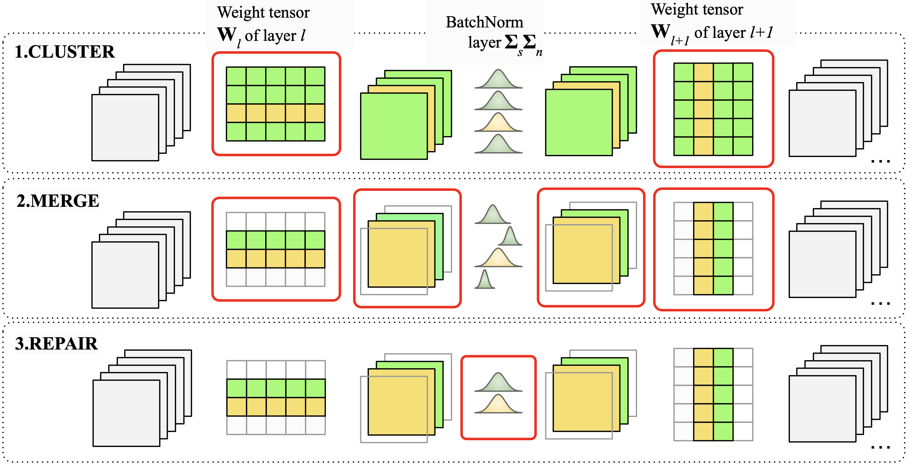

# Forget the Data and Fine-Tuning! Just Fold the Network to Compress
**[Forget the Data and Fine-Tuning! Just Fold the Network to Compress](https://openreview.net/forum?id=W2Wkp9MQsF) @ ICLR 2025** \
[Dong Wang]()\*, 
[Haris Šikić]()\*, 
[Lothar Thiele](), 
[Olga Saukh](),\
Graz University of Technology, Austria  \
Complexity Science Hub Vienna, Austria \
ETH Zurich, Switzerland \
_[GitHub](https://github.com/marza96/ModelFolding)_ | _[arXiv](https://openreview.net/forum?id=W2Wkp9MQsF)_ | _[BibTeX](#citation)_

\*: Equal Contribution.



## Installation
Create Anaconda environment and install dependencies
```bash
conda create -n folding_env python=3.8
conda activate folding_env
pip install torch torchvision torchaudio
pip install -r requirements.txt

git clone https://github.com/marza96/ModelFolding.git
cd ModelFolding
```
## Running the code
### Approximate REPAIR experiments
To run an experiment involving approximate (data-free) REPAIR type the following:
```bash
python <experiment_name>_approx_repair.py --checkpoint <path_to_weights> --proj_name <wandb project name> --exp_name <wandb experiment name>
```
For example:
```bash
python resnet18_cifar10_weight_clustering_approx_repair.py --checkpoint ./resnet18_cifar10.pt --proj_name foo --exp_name bar
```
### REPAIR experiments 
To run an experiment involving REPAIR type the following:
```bash
python <experiment_name>.py --checkpoint <path_to_weights> --proj_name <wandb project name> --exp_name <wandb experiment name> --repair "REPAIR"
```
For example:
```bash
python resnet18_cifar10_weight_clustering_approx_repair.py --checkpoint ./resnet18_cifar10.pt --proj_name foo --exp_name bar --repair "REPAIR"
```
### NO REPAIR experiments 
To run the experiments without REPAIR type the following:
```bash
python <experiment_name>.py --checkpoint <path_to_weights> --proj_name <wandb project name> --exp_name <wandb experiment name> --repair "REPAIR"
```
For example:
```
python resnet18_cifar10_weight_clustering_approx_repair.py --checkpoint ./resnet18_cifar10.pt --proj_name foo --exp_name bar --repair "NO_REPAIR"
```
### Deep Inversion REPAIR experiments 
#### **Important Note:**
To generate the Deep Inversion synthetic samples for Deep Inversion REPAIR please refer to [DeepInversion](https://github.com/NVlabs/DeepInversion). Our pipeline requires a batch of synthetic samples generate using DeepInversion, saved as a .pt file.

To run the experiments with Deep Inversion samles type the following:
```bash
python <experiment_name>.py --checkpoint <path_to_weights> --proj_name <wandb project name> --exp_name <wandb experiment name> --repair "DI_REPAIR" --di_samples_path <path_to_deep_inversion_images>
```
where <path_to_deep_inversion_images> denotes a serialized tensor containing the Deep Inversion synthetic samples extracted from the uncompressed model. For example:
```bash
python resnet18_cifar10_weight_clustering_approx_repair.py --checkpoint ./resnet18_cifar10.pt --proj_name foo --exp_name bar --repair "DI_REPAIR" --di_samples_path ./resnet18_di_samples.pt
```
## Citation
If this work was helpful for you, please cite:
```
@inproceedings{
anonymous2025forget,
title={Forget the Data and Fine-Tuning! Just Fold the Network to Compress},
author={Anonymous},
booktitle={The Thirteenth International Conference on Learning Representations},
year={2025},
url={https://openreview.net/forum?id=W2Wkp9MQsF}
}
```